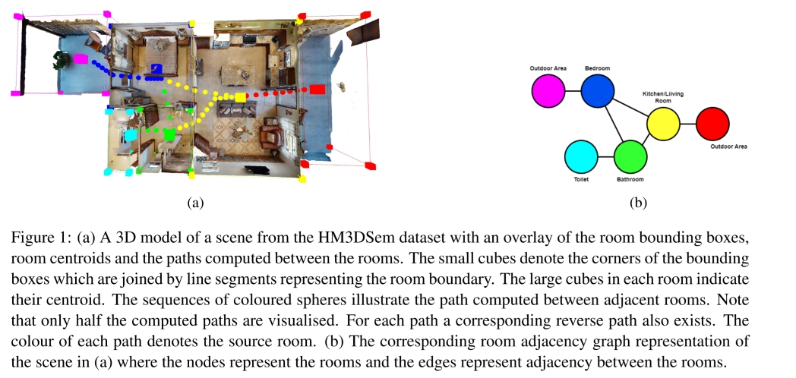

# DomestiGraph: A Dataset of Domestic Environment Room Adjacency Scene Graphs
This dataset provides room labels, bounding boxes and interconnections between rooms for 50 scenes from the [Habitat-Matterport 3D Semantics Dataset (HM3DSem)](https://aihabitat.org/datasets/hm3d-semantics/). 



## Environment Setup

This code was developed on `Ubuntu 22.04` using `habitat-sim v0.3.1`

1. Create and activate conda environment
    ```
    conda create -n domestigraph python=3.9 cmake=3.14.0
    conda activate domestigraph
    ```
2. Install [habitat-sim](https://github.com/facebookresearch/habitat-sim?tab=readme-ov-file#documentation)
    ```
    conda install habitat-sim -c conda-forge -c aihabitat
    ```
3. Install [Open3D](https://github.com/isl-org/Open3D?tab=readme-ov-file)
    ```
    pip3 install open3d
    ```
4. Gain access to the HM3D data by following [these instructions](https://matterport.com/partners/meta)

5. Once you have been granted access to the data, the `habitat` and `obj+mtl` files for the `train` and `val` splits can be downloaded from [here](https://github.com/matterport/habitat-matterport-3dresearch). The `obj+mtl` files are under `HM3D v0.1`. 

6. Clone this repository
    ```
    git clone git@bitbucket.org:frank-gallagher/domestigraph.git
    ```

## Usage
Run `main.py` providing the parent directory of the `scene_datasets` folder and the index of the scene you want to process
```
python3 main.py --parent-dir </path/to/parent/directory> --scene-index <index of scene to be processed>
```

This produces a YAML file `<name_of_scene>.yaml` with the bounding box, object and connections data for each room. 

To label a room, open this file and manually fill in the `label` field, using the 3D visualisation and the room index indicator to assist you.

Once the 3D visualisation is closed, a new YAML file is automatically produced with the object data for each room removed. This is the format of the data provided in this repository.

__Notes:__ 
- The parent directory only needs to be provided the first time the script is run to produce the `HM3DSem_paths.json` file which contains the absolute paths to the files for each scene required by habitat-sim
- Room 0 in each of the HM3DSem scenes is a null region which is ignored by our process. Therefore, indexing starts at 1


### Labelling Convention
In our dataset we use 13 room classes:
```
bathroom, 
bedroom, 
closet, 
dining room, 
garage, 
hallway, 
kitchen, 
living room, 
office, 
other, 
outdoor area, 
toilet, 
utility room
```

`hallway` refers to any room with the sole function of connecting rooms together. 

`outdoor area` refers to gardens, porches, balconies etc. 

`dining room` refers to a dining area distinct from a kitchen so a `kitchen/dining room` label is applied to a room when the kitchen is distinct from the dining area but they are assigned to the same room. A kitchen with a table does not qualify as a `kitchen/dining room`. 

`other` refers to rooms where the function is unclear.

__bathroom vs toilet:__ The `toilet` label refers to a room that only contains a toilet and wash basin. The `bathroom` label refers to a room with a wash basin and a shower/bath. A `bathroom` may or may not contain a toilet.

__Multifunctional Rooms:__ Labels can be chained together with `/` for rooms that contain more than one function. For example, a kitchen with a sitting area is labelled as `kitchen/living room`.


Of course any set of labels can be used which best suit the application.

## Citation
If you use this dataset in your research please cite
```
@inproceedings{Gallagher2024,
    title = {A Dataset of Domestic Environment Room Adjacency Scene Graphs},
    author = {Frank Gallagher and Louis Gallagher and Marco Cognetti and John B. McDonald},
    booktitle = {Irish Machine Vision and Image Processing Conference},
    year = {2024}
}
```

## Matterport Terms of Service
The data provided in this repository is derived from the [HM3DSem](https://aihabitat.org/datasets/hm3d-semantics/) dataset so is covered by the [Matterport Terms of Service](https://matterport.com/legal/matterport-end-user-license-agreement-academic-use-model-data).

## Acknowledgements
This work was funded by the Irish Research Council Government of Ireland Postgraduate Scholarship Scheme 2023 (GOIPG/2023/3321).